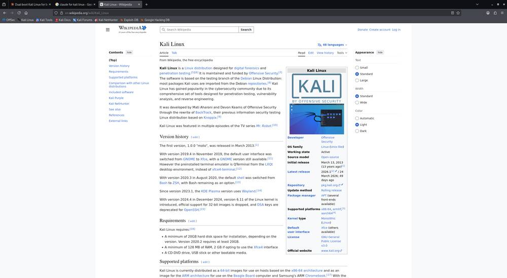
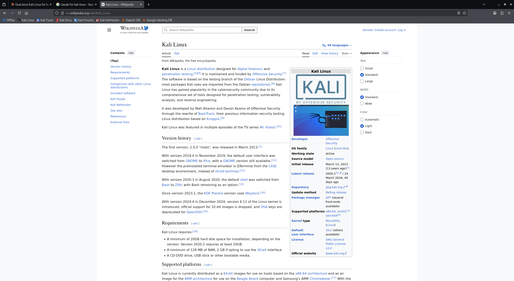
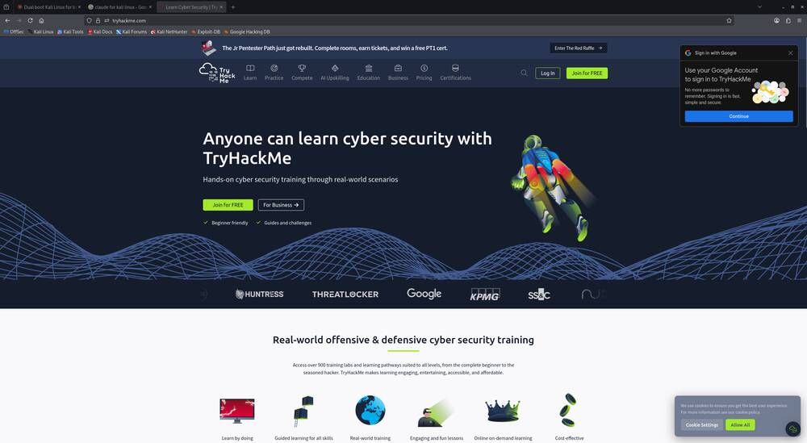
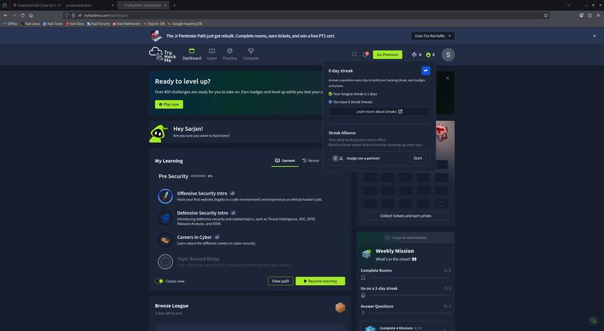
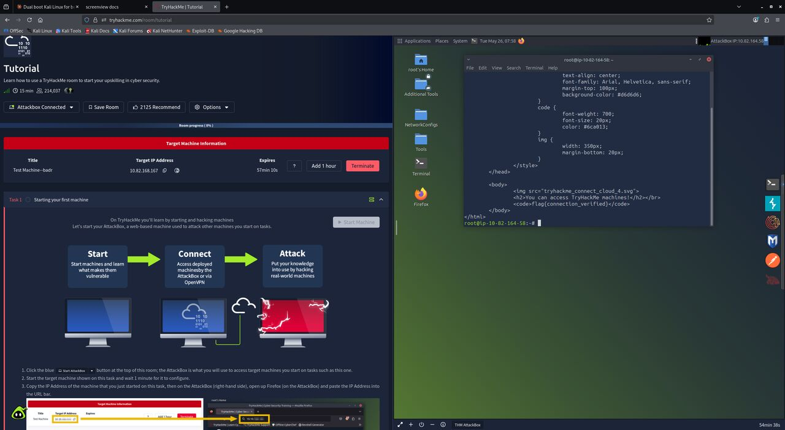
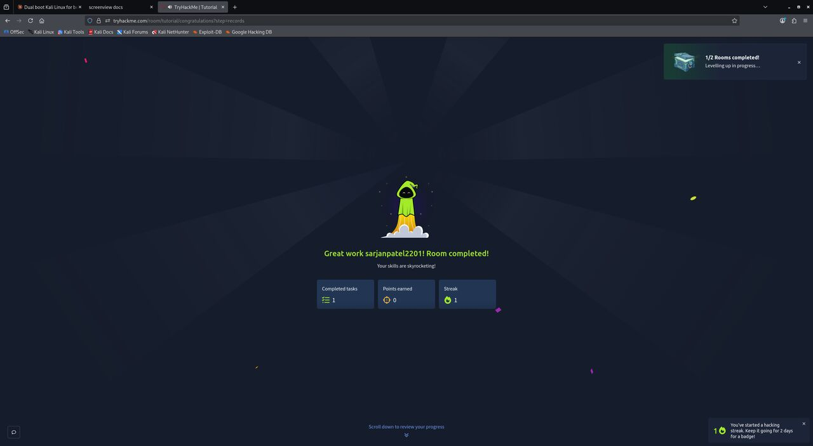

# Performance

Real measurement of `screenview` against an **image + text** web page:
the [Kali Linux Wikipedia article](https://en.wikipedia.org/wiki/Kali_Linux),
captured live in Firefox at 2560×1405.

## ⚠️ How the token numbers are derived (honest methodology)
These are **estimates**, not exact model token counts (the model's tokenizer isn't queried
directly). They use the publicly documented approximations:

- **Text:** `tokens ≈ characters ÷ 4` (typical English ratio).
- **Images:** the API resizes so the long edge is ≤ 1568 px, then `tokens ≈ (width × height) ÷ 750`.
  - A 2560×1405 capture is scaled to ~1568×860 → ≈ **1,798 tokens**.
  - A 1000×549 downscaled JPG is under the cap → ≈ **732 tokens**.

So treat the numbers as *order-of-magnitude*, accurate enough to compare methods — the
**ratios** (e.g. "OCR is ~2× cheaper than a full PNG here") are the reliable part.

## What we see — same page, two captures

The cheap downscaled JPG keeps both the logo image **and** readable text:



The full-resolution PNG looks the same to a human but costs far more in tokens and bytes:



## Measured results (this page)

| Method | Output | Raw size | Est. tokens | Answers… |
|--------|--------|----------|-------------|----------|
| `windows` (title) | text | 70 chars | **~18** | "what page is open?" |
| `read` (OCR) | text | 3,172 chars | **~793** | "what does the article say?" |
| `shot` downscaled JPG | image | 55 KB / 1000×549 | **~732** | "what does it look like?" (image + text) |
| **full PNG (old way)** | image | 448 KB / 2560×1405 | **~1,798** | "what does it look like?" |

## Before vs After

| Goal | Best method | Tokens | vs full PNG |
|------|-------------|--------|-------------|
| Know which page is open | `windows` | ~18 | **−99%** |
| Read the article text | `read` (OCR) | ~793 | **−56%** |
| See the page (image+text) | downscaled `shot` | ~732 | **−59%** |
| (baseline) full screenshot | full PNG | ~1,798 | — |

## Honest nuance on this page
This Wikipedia article is **very text-dense**, so OCR (~793) costs *about the same* as the
downscaled image (~732) — when there's that much text, extracting it isn't "free." The split
that still holds:

- Just need the **identity** of the page → `windows` title (~18 tokens, −99%). Almost always
  the right first move.
- Need the **content** as usable text → OCR.
- Need the **visual** (layout, images, charts) → downscaled JPG, never the full PNG.

The downscaled JPG is **8× smaller in bytes** (55 KB vs 448 KB) and ~2.5× cheaper in tokens
than the full PNG, with no loss of legibility for a human or the model (compare the two images
above — they're indistinguishable at reading size).

## Task-level A/B test — a real task on TryHackMe

Same task done two ways, to measure *agent* performance end-to-end, not just one look.

**Task:** open [tryhackme.com](https://tryhackme.com), identify the page, read the main
headline, and locate the primary call-to-action button.



From the cheap captures the task was fully solved: page = "Learn Cyber Security | TryHackMe",
headline = *"Anyone can learn cyber security with TryHackMe"*, primary CTA = the green
**"Join for FREE"** button (hero + top-right nav).

| Step | OLD way (full PNG only) | NEW way (screenview) | tokens new |
|------|-------------------------|----------------------|-----------|
| Identify the page | part of one full PNG | `windows` title | ~24 |
| Read the headline | read out of the image | OCR `read` | ~310 |
| Locate the CTA button | estimate from the image | downscaled `shot` | ~732 |
| **Total** | **~1,798** (one 2560×1405 PNG) | **~1,066** | |

- **Full task** (needs a visual to place the button): **~1,066 vs ~1,798 → −41%**.
- **Informational part only** (identify page + read headline, no button): title + OCR =
  **~334 vs ~1,798 → −81%**.

Beyond raw tokens, the new way is also **more accurate**: OCR returns the headline as exact
text instead of the model re-reading pixels, and the title string identifies the page with
near-zero cost. The full PNG is reserved only for the one step that truly needs pixels.

## Harder A/B — a logged-in, dynamic page (TryHackMe Dashboard)

The landing page is static; this test is on an **authenticated, dynamic dashboard** — the
realistic hard case. Task: read the user's dashboard state (username, learning progress) and
see the layout (streak panel, weekly mission).



Solved from the cheap captures: user = **Sarjan**, path = **Pre Security 0%** (Offensive/
Defensive Security Intro, Careers in Cyber), **Bronze League**, weekly mission progress 0/2,
0/2, 0/3 — all read without a full-resolution screenshot.

| Step | OLD (full PNG only) | NEW (screenview) | tokens new |
|------|---------------------|------------------|-----------|
| Identify the page | part of one full PNG | title | ~8 |
| Read username + progress | read out of image | OCR `read` | ~388 |
| See layout (streak/missions) | from image | downscaled `shot` | ~732 |
| **Total** | **~1,798** | **~1,128** | |

- **Full task: ~1,128 vs ~1,798 → −37%.**
- **Info-only** (username + progress, no layout): title + OCR = **~396 vs ~1,798 → −78%.**

Even on a busy dynamic page, OCR pulled the account details as exact text and the cheap JPG
(37 KB) carried the whole visual — the full PNG was never needed.

## Live challenge A/B — solving a full TryHackMe room

The hardest test: drive an **interactive** task end-to-end, not just read one screen. The
TryHackMe *Tutorial* room was solved on the in-browser **AttackBox**: join room → start
AttackBox → deploy target → reach the target → capture the flag → submit.

The decisive data came back as **text**, not pixels — the target IP and the flag were read
from the terminal, by running `curl` against the target on the AttackBox:



```
<code>flag{connection_verified}</code>
```



### Tokens: interactive tasks behave differently
Driving a GUI needs visual feedback at almost every step, so this is the **image-heavy** case
where text methods can't replace looking. Roughly ~15 visual checks were needed.

| Per visual check | tokens | Whole room (~15 looks) |
|------------------|--------|------------------------|
| OLD: full-res PNG (2560×1405) | ~1,798 | **~27,000** |
| NEW: downscaled JPG (1280 px) | ~1,200 | **~18,000** |
| NEW (tighter, 1000 px) | ~732 | ~11,000 |

- End-to-end the new way (1280 px shots) ran **~33% cheaper**; with 1000 px shots it would be
  **~60% cheaper**.
- The real win wasn't the image ratio — it was pulling the **IP and flag as text** (`curl` +
  OCR) instead of squinting at a rendered web page in a full screenshot. That's both cheaper
  *and* exact (no misread characters in the flag).

### Honest takeaway
- **Inspection / reading tasks** → huge savings (−80% to −96%): text methods replace images.
- **Interactive / GUI-driving tasks** → modest savings (~−33% to −60%): you still must see each
  step, so the lever is downscaled-vs-full image, plus extracting key values as text/CLI.
- Either way, scaling the capture to the task — and reaching for text/CLI whenever possible —
  beats reflexively grabbing a full-resolution screenshot every time.

## Bottom line on performance
- Routine "what's happening on screen" checks drop from ~1,800 tokens to **tens of tokens**.
- Even when a picture is genuinely required, the downscaled JPG saves **~60%**.
- The toolkit lets the agent spend tokens *in proportion to what the task needs*, instead of
  paying full-image price for every glance.
